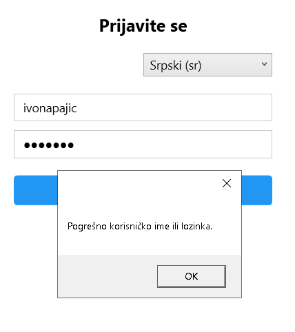

---
header-includes:
  - \usepackage{float}
  - \let\origfigure\figure
  - \let\endorigfigure\endfigure
  - \renewenvironment{figure}[1][]{\origfigure[H]}{\endorigfigure}
---
# AutoServis – Sistem za upravljanje auto servisom

Dobrodošli u **AutoServis** – aplikaciju namijenjenu za efikasno upravljanje radom auto-servisa, sa posebnim fokusom na korisničko iskustvo, personalizaciju i podršku za tri korisnička profila: **klijente**, **radnike** i **administratora**.

## Uvod

Ovaj priručnik je namijenjen svim korisnicima sistema AutoServis – klijentima, zaposlenima i administratorima – i objašnjava kako koristiti aplikaciju za efikasno upravljanje radom auto servisa. Aplikacija omogućava vođenje evidencije o klijentima, rezervacijama, uslugama, dijelovima na lageru i računima.
Klijenti mogu zakazivati usluge, pregledati svoje račune i birati dostupne usluge. Zaposleni (radnici) upravljaju rezervacijama, dodaju usluge i dijelove, ažuriraju statuse i izdaju račune. Administrator ima dodatne privilegije: može upravljati korisnicima (klijentima i radnicima), kao i šifarnicima – tipovima usluga i dijelovima na lageru.
Svi korisnici imaju pristup personalizaciji – mogu promijeniti temu interfejsa (plavu, zelenu ili crvenu) i jezik aplikacije (srpski ili engleski). Sve postavke se automatski čuvaju i vraćaju prilikom naredne prijave.
Aplikacija podržava tri tipa korisnika:

- **Klijent** – može zakazivati usluge, pregledati račune i birati usluge.
- **Zaposleni (radnik)** – upravlja rezervacijama, dijelovima, uslugama i izdaje račune.
- **Administrator** – upravlja korisnicima i šifarnicima (uslugama i dijelovima), ali nema pristup evidenciji o klijentima, rezervacijama, pregledima i računima.

## Prijavljivanje na sistem

### Za klijente

Nakon pokretanja aplikacije korisniku se prikazuje prozor za prijavu, na kom se očekuje da unese svoje kredencijale (korisničko ime i lozinku).

Ukoliko kredencijali nisu ispravni ili ukoliko neki od parametara nije unesen, pojavljuje se poruka koja to naznačava korisniku.

Ako nemate nalog, kliknite na **"Nemate nalog? Registrujte se"** i popunite obrazac.

Korisnik se prijavljuje klikom na dugme “Prijavi se”. Nakon uspješne prijave, korisniku se prikazuje glavni meni prilagođen njegovoj ulozi.

### Za radnike i administratore

Isto kao i za klijente, i za ostale korisnike nakon pokretanja aplikacije korisniku se prikazuje prozor za prijavu, na kom se očekuje da unese svoje kredencijale (korisničko ime i lozinku).

Ako nemate nalog, kliknite na **"Nemate nalog? Registrujte se"** i popunite obrazac.

## Glavni meni

Nakon prijave, otvara se glavni meni. Glavni meni se razlikuje u zavisnosti od tipa korisnika.
Klijentu se prikazuje stranica na kojoj se prikazuje meni koji sadrži pregled tipova usluga koje servis nudi, kreiranje ili pregled postojećih rezervacija, pregled i pretraga računa po datumu.

Radnik ima mogućnost pregleda, dodavanja, brisanja tipova usluga koje servis nudi, dodavanje novih vrsta dijelova na lager, kao i uvećavanje količine na lageru postojećih dijelova. Dodatno, u slučaju pregleda rezervacija, radnik ima mogućnost ažuriranja statusa rezervacije, pregled informacija o klijentu koji je kreirao rezervaciju, odabir usluga i dijelova koji su potrebni, te izdavanje računa. Takođe, radnici mogu upravljati klijentima u servisu – dodavati i brisati.

Administrator ima iste mogućnosti kao i radnik. Dodatno, ima mogućnost upravljanja i radničkim nalozima. Može da dodaje ili briše radničke naloge, te da mijenja ulogu korisničkog naloga tipa Radnik u korisnički nalog tipa Administrator – tj. samo administrator može da dodaje nove administratore.

## Tipovi usluga

Kao klijent, nakon prijave možete pristupiti listi usluga kroz meni sa leve strane. Tamo ćete videti naziv svake usluge (npr. „Zamjena ulja“, „Servis motora“) i njenu trenutnu cijenu u konvertibilnim markama (KM). Ova informacija je namenjena da vam pomogne da unapred saznate koliko košta određeni rad, uporedite usluge i bolje planirate budžet za održavanje vozila. Imajte u vidu da kao klijent ne možete da menjate nazive, cijene ili dodajete nove usluge – to je funkcija koju obavljaju samo ovlašćena lica.

S druge strane, administratori/radnici imaju proširene mogućnosti u istom meniju.

Pored pregleda, mogu dodavati nove usluge unosom naziva i cijene te klikom na dugme "Dodaj" ili obrisati one koje više nisu u ponudi klikom na dugme "Obriši".

Administrator/radnik može izmijeniti cijenu postojeće usluge.

Svaka promjena se odmah primjenjuje i vidljiva je svim klijentima, pa je važno da se cijene ažuriraju pažljivo i da se brisanje vrši samo ako usluga nije već korišćena u nekoj rezervaciji. Takođe, sistem omogućava osvježavanje liste kako bi svi korisnici uvek imali pristup najnovijim informacijama. Preporučuje se da se koriste jasni i opisni nazivi usluga, kao što su „Mali servis“ ili „Provjera kočnica“, kako bi klijenti lakše razumjeli šta tačno usluga podrazumijeva. Na taj način, lista tipova usluga postaje transparentan i pouzdan alat za komunikaciju između servisa i njegovih korisnika.

## Dijelovi na lageru

„Dijelovi na lageru“ omogućava administratorima i radnicima da efikasno prate i upravljaju zalihama rezervnih dijelova. Kada kliknete na ovu opciju u meniju, otvara se pregledna tabela koja prikazuje sve dijelove koji su trenutno dostupni u servisu, uz njihovu tačnu količinu na stanju. U tabeli su tri osnovne kolone: „Naziv“ (npr. „Filter ulja“, „Kočione pločice“, „Lamela“), „Količina“ (broj komada na lageru) i „Uvećaj“ – dugme koje omogućava brzo dodavanje novih komada u zalihe.

Za dodavanje, koristite polja iznad tabele: unesite naziv dijela (npr. „Dizna“) i željenu količinu (npr. 200), zatim kliknite na dugme „Dodaj/Obnovi“. Ova funkcionalnost je posebno korisna kada dolaze nove isporuke dijelova ili kad treba ručno popraviti grešku u stanju. Svaki put kad se promijeni količina, tabela se automatski osvježava, što omogućava stalno praćenje stanja lagera bez potrebe za ponovnim učitavanjem stranice.

Ovaj dio sistema je namenjen isključivo administrativnom osoblju i radnicima – klijenti nemaju pristup ovoj funkciji, jer nije potrebno da vide interne informacije o zalihama. Međutim, svaki put kad se dio koristi tokom servisa, sistem automatski smanjuje njegovu količinu na lageru, čime se obezbeđuje precizna evidencija i sprečava preprodaja dijelova koji više nisu dostupni. Takođe, mogućnost da se svaki dio pojedinačno uveća (preko dugmeta „Uvećaj“) omogućava brzu i jednostavnu korekciju stanja – npr. ako je došlo do greške u unošenju ili ako je primljen dodatni komad nakon servisa.

## Rezervacije

Nakon što klijent klikne na opciju "Rezervacije", otvara se forma za kreiranje nove rezervacije gde treba da unesete osnovne podatke o vašem vozilu i problemu koji želite da riješite. U polju „Model vozila“ upišite naziv modela (npr. „Golf 6“), a u polju „Godina proizvodnje“ navedite godinu izrade vozila. Sljedeće polje, „Opis problema“, služi da detaljnije opišete šta je potrebno uraditi – npr. „Problemi sa kočnicama“ ili „Mali servis“. Na kraju, odaberite datum usluge u formatu YYYY-MM-DD (npr. 2025-11-10). Kada su svi podaci unijeti, kliknite na dugme „Kreiraj rezervaciju“. Sistem će vas obavijestiti porukom „Uspjeh: Rezervacija je uspješno kreirana!“, čime je vaš zahtev zabilježen i spreman za obradu.

Nakon što kreirate rezervaciju, sve vaše prethodne i buduće rezervacije prikazuju se ispod forme u tabeli koja sadrži kolone „Datum usluge“, „Status“ i „Opis“. Ovdje možete vidjeti koje su rezervacije još uvijek „Na čekanju“, a koje su već „Završene“. Tabela vam omogućava pregled svih aktivnosti vezanih za vaše vozilo, tako da lako pratite šta je urađeno. Ako želite da dodate novu rezervaciju, jednostavno ponovite postupak – sistem automatski dodaje novi red u tabelu bez brisanja postojećih.

S druge strane, kada se ulogujete kao radnik ili administrator, vidite listu svih rezervacija koje su napravili klijenti.

Klikom na određenu rezervaciju, otvara se detaljan prikaz klijenta i mogućnost da se ažurira status rezervacije (npr. sa „Na čekanju“ na „Završeno“). Takođe, možete izabrati koje usluge su potrebne (npr. „Zamjena ulja“, „Servis motora“) i koji dijelovi su potrebni (npr. „Filter ulja“, „Kočione pločice“), te ih dodati u račun. Na dnu ekrana nalaze se dugmad „Dodaj usluge i dijelove“ i „Izdaj račun“, što olakšava brzo i precizno fakturisanje nakon završetka rada. Ova funkcionalnost omogućava efikasno praćenje, planiranje i finansijsku evidenciju svih servisnih poslova.

## Računi

Klijenti imaju pristup sopstvenom pregledu računa kroz meni „Računi“. Nakon prijave, klijent vidi listu svih svojih računa sa kolonama: „Broj računa“ (npr. RAC-20251014-2), „Datum“ izdavanja i „Ukupno“ – ukupna suma koju je treba da plati.

Dugmad „Pretraži po datumu“ i „Prikaži sve“ dodatno olakšavaju navigaciju – prvi omogućava filtriranje računa po određenom danu, dok drugi prikazuje cijelu istoriju bez ograničenja. Kada kliknete na „Pretraži po datumu“, otvara se kalendarski izbor koji vam omogućava da odaberete tačan datum za koji želite da vidite račune. Na primjer, ako izaberete 14. oktobar 2025, sistem će prikazati samo one račune koji su izdati tog dana. Kalendarski prikaz je intuitivan, podržava navigaciju ka prethodnim i sledećim mesecima, a izabrani datum se istakne bojom kako bi bilo jasno šta je trenutno aktivno.

Kod administratora/radnika, ekran „Kreiraj račun“ prikazuje detaljan pregled svih izvršenih usluga vezanih za određenu rezervaciju, uz informacije o klijentu. U tabeli su navedene kolone: „Usluga“ (npr. „Zamjena ulja“, „Servis motora“), „Količina“, „Cijena“ po jedinici i „Ukupno“ – što predstavlja ukupnu cijenu za tu uslugu. Na dnu ekrana nalazi se dugme „Izdaj račun“, koje potvrđuje generisanje finalnog računa i čuva ga u sistemu kao zvaničan dokument. Ovaj ekran omogućava brz i precizan pregled troškova pre nego što se račun preda klijentu, što sprečava greške i osigurava transparentnost.

## Klijenti

Upravljanje klijentima omogućava administratorima i radnicima da efikasno prate i dodaju klijente. Ovaj dio sistema je dostupan samo ovlašćenom osoblju, jer sadrži osjetljive podatke poput kontakta i adrese. Kada se ulogujete kao radnik ili administrator i izaberete opciju „Klijenti“ u meniju, otvara se pregledna tabela koja prikazuje sve postojeće klijente sa kolonama: „Korisničko ime“, „Kontakt“ (email ili telefon) i „Adresa“. Ova lista je stalno ažurirana i omogućava brz pregled svih korisnika koji su ikada koristili usluge servisa.

Za dodavanje novog klijenta, jednostavno kliknite na dugme „Dodaj klijenta“. Sistem će otvoriti prozor sa tri koraka – svaki put traži jednu ključnu informaciju. Prvo, unesite korisničko ime – to je jedinstveni identifikator klijenta u sistemu (npr. milosjankovic).

Nakon što potvrdite unos, sistem prelazi na sledeći korak – unos kontakta (email ili broj telefona), npr. milosjankovic@gmail.com.

Na kraju, unesite adresu – npr. Desanke Maksimovic 2.

Svaki korak je zaseban, što olakšava tačan unos podataka bez grešaka. Kada završite sva tri polja i kliknete „OK“, novi klijent se automatski dodaje u tabelu i postaje dostupan za rezervacije i račune.
Ako želite da obrišete nekog klijenta, izaberite ga u tabeli i kliknite na dugme „Obriši klijenta“. Sistem će vas pitati da potvrdite akciju, kako bi sprečio slučajno brisanje.

Na kraju svakog reda nalazi se dugme „Izmijeni“, koje omogućava brzu izmenu podataka korisnika.

## Upravljanje korisnicima (radnicima i administratorima)

Za dodavanje novog radnika ili administratora, kliknite na dugme „Dodaj korisnika“. Sistem će vas voditi kroz više koraka:

1. Unos imena korisnika:  
   

2. Unos prezimena:  
   

3. Unos korisničkog imena (jedinstvenog identifikatora):  
   

4. Unos kontakta (email ili telefon):  
   

5. Unos lozinke:  
   

6. Odabir uloge (Radnik ili Administrator):  
   

Svaki korak je zaseban, što olakšava tačan unos podataka bez grešaka. Kada završite sva polja i kliknete „OK“, novi korisnik se automatski dodaje u sistem.
Ako želite da obrišete nekog korisnika, izaberite ga u tabeli i kliknite na dugme „Obriši korisnika“. Sistem će vas pitati da potvrdite akciju, kako bi sprečio slučajno brisanje.

Na kraju svakog reda nalazi se dugme „Izmijeni“, koje omogućava brzu izmjenu podataka korisnika.

## Podešavanja

Svi korisnici aplikacije imaju mogućnosti podešavanja koja uključuju podešavanje teme i jezika.
Na početku, pri prijavi, možete izabrati jezik interfejsa – bilo da preferirate srpski jezik ili engleski. Ova opcija nalazi se u padajućem meniju ispod naslova „Prijavite se“ – jednostavno kliknite na strelicu i odaberite željeni jezik (npr. „Srpski (sr)“ ili „English (en)“). Nakon što se ulogujete, cijeli sistem će automatski preći na izabrani jezik, uključujući nazive dugmadi, naslove ekrana i poruke. Ovo olakšava korišćenje sistema za sve korisnike, bez obzira na njihov jezički preferenc.

Primjer izgleda aplikacije na engleskom jeziku:

Uz promjenu jezika, sistem takođe omogućava personalizaciju izgleda putem tema – boja i fontova koji se primenjuju na cjelokupan interfejs. U lijevom meniju, ispod oznake „Tema“, nalazi se padajući spisak sa dostupnim opcijama: Plava, Zelena, Crvena.

Kada izaberete temu, svi dugmadi, pozadine i tekstovi će se automatski promijeniti u odgovarajuće nijanse.

  

Promjena teme se odmah primjenjuje na sve ekrane koje koristite – od pregleda računa do kreiranja rezervacija i upravljanja dijelovima. Takođe, tema se pamti za svakog korisnika pojedinačno – sistem će vam prikazati vašu ličnu postavku prilikom svake prijave.

---
> **AutoServis 2025**